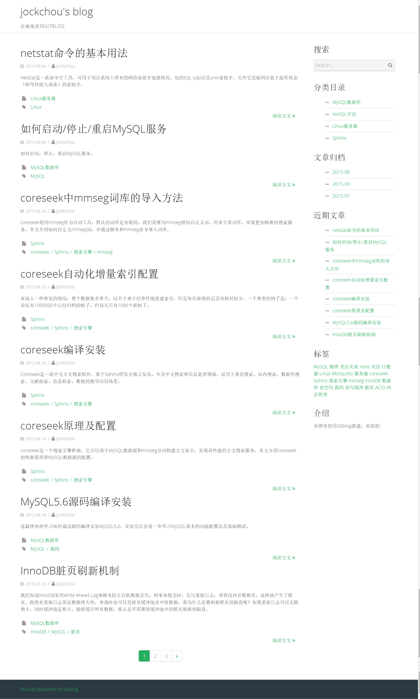

## 一. 简介 ##
GitBlog是一个简单易用的Markdown博客系统，它不需要数据库，没有管理后台功能，更新博客只需要添加你写好的Markdown文件即可。它摆脱了在线编辑器排版困难，无法实时预览的缺点，一切都交给Markdown来完成，一篇博客就是一个Markdown文件。同时也支持评论，代码高亮，数学公式，页面PV统计等常用功能。GitBlog提供了不同的主题样式，你可以根据自己的喜好配置，如果你想自己制作博客主题，也是非常容易的。GitBlog还支持整站静态导出，你完全可以导出整站静态网页部署到Github Pages。

预览

## 二. 功能特点 ##

1. 使用Markdown  
2. 评论框  
3. 代码高亮  
4. PV统计  
5. Latex数学公式  
6. 自制主题  
7. 响应式  
8. 全站静态导出  
9. 良好的SEO  

## 三. GitBlog优势 ##
 
1. 无需数据库，系统更轻量，移植更方便  
2. 使用Markdown编写，摆脱后台编辑排版困难，无法实时预览的缺点  
3. 可全站静态导出  
4. 配置灵活，可自由开关某些功能  
5. 多主题支持，可自制主题  
6. 博客，分类，标签，归档  

## 四. 环境要求 ##

- PHP 5.2.4+ 
- mbstring扩展支持 
- php.ini开启short_open_tag = On 

## 五. 安装步骤 ##

1. 下载GitBlog源代码  
2. 解压上传到你的PHP网站根目录  
3. 打开浏览器，访问网站首页  
4. 上传Markdown文件到`posts`文件夹  

## 六. 详细说明 ##

[1. 安装][1]  
[2. 目录结构][2]  
[3. 配置说明][3]  
[4. 编写博客][4]  
[5. 评论，订阅，统计等][5]  
[6. 缓存机制][6]  
[7. 全站静态导出][7]  
[8. 主题制作][8]  
[9. 在Nginx上运行GitBlog][9]  
[10. 在Apache上运行GitBlog][10]  
[11. 在SAE上运行GitBlog][11]  
[12. 使用GitBlog和Github Pages搭建博客][12]  
[13. Gitblog升级][13]  
[14. 从wordpress导入][14]

## 七. 问题及bug反馈 ##

如果在实际使用过程中对GitBlog有新的功能需求，或者在使用GitBlog的过程中发现了Bug，欢迎反馈给我。可以直接在Github上提交，也可以发邮件至`164068300[AT]qq.com`与我取得联系，我将及时回复。如果你自己制作了漂亮好用的主题，也非常欢迎你提交给我，我会在这里展示你的主题链接。如果你正在使用GitBlog，也可以告诉我，我将也会在这里列出使用者名单。如果你想和其他GitBlog使用者讨论交流，欢迎加入QQ群`84692078`。

## 八. 使用者列表 ##

- [Weeds][20]
- [橙子][21]
- [jockchou][22]
- [GitBlog Doc][23]
- [zxy][24]  
- [ckeyer][25]
- [江湖隐行客][26]
- [liyu34][27]

## 九. 感谢 ##

GitBlog的成长需要喜欢Markdown，喜欢写博客的各位亲们支持！感谢你们使用GitBlog，感激你们对Gitblog的良好建议和Bug反馈。

QQ群：`84692078`  
作者邮箱：`164068300[AT]qq.com`    

[1]:https://github.com/jockchou/gitblogdoc/tree/master/posts/gitblog/install.md
[2]:https://github.com/jockchou/gitblogdoc/tree/master/posts/gitblog/struct.md
[3]:https://github.com/jockchou/gitblogdoc/tree/master/posts/gitblog/config.md
[4]:https://github.com/jockchou/gitblogdoc/tree/master/posts/gitblog/edit.md
[5]:https://github.com/jockchou/gitblogdoc/tree/master/posts/gitblog/other-func.md
[6]:https://github.com/jockchou/gitblogdoc/tree/master/posts/gitblog/cache.md
[7]:https://github.com/jockchou/gitblogdoc/tree/master/posts/gitblog/export.md
[8]:https://github.com/jockchou/gitblogdoc/tree/master/posts/gitblog/theme.md
[9]:https://github.com/jockchou/gitblogdoc/tree/master/posts/gitblog/nginx.md
[10]:https://github.com/jockchou/gitblogdoc/tree/master/posts/gitblog/apache.md
[11]:https://github.com/jockchou/gitblogdoc/tree/master/posts/gitblog/sae.md
[12]:https://github.com/jockchou/gitblogdoc/tree/master/posts/gitblog/github-pages.md
[13]:https://github.com/jockchou/gitblogdoc/tree/master/posts/gitblog/update.md
[14]:https://github.com/jockchou/gitblogdoc/tree/master/posts/gitblog/wordpress.md

[20]: http://blog.hiweeds.net
[21]: http://xiaochengzi.gitblog.cn
[22]: http://jockchou.com
[23]: https://github.com/jockchou/gitblogdoc
[24]: http://zxy.link
[25]: http://blog.ckeyer.com
[26]: http://wangzugang.net
[27]: http://liyu34.xyz
