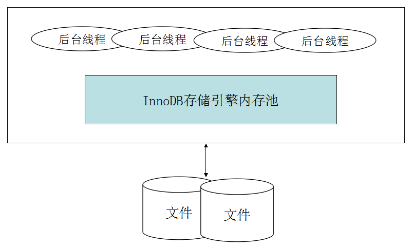
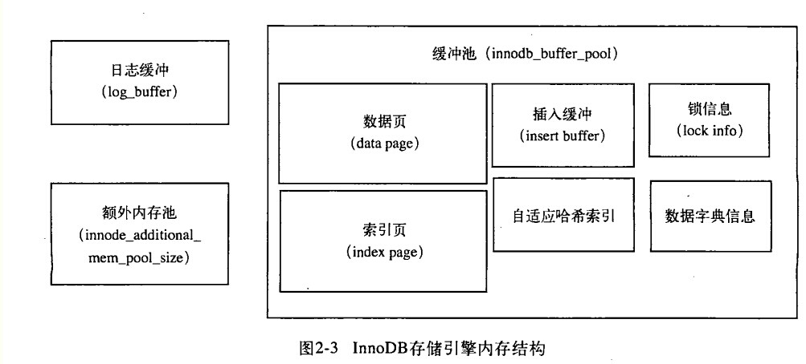

# InnoDB体系构架 #

在InnoDB存储引擎的架构中，有多个内存块，这些内存块组成一个内存池。InnoDB存储引擎体系架构如下图所示：



# 后台线程 #

后台线程的主要作用是负责刷新内存池中的数据，保证缓冲池中的内存缓存的是最近的数据，另外，将已修改的数据文件刷新到磁盘文件，同时，保证在数据库发生异常的情况下，InnoDB能恢复到正常运行状态。InnoDB是多线程模型，不同的线程用于处理不同的任务。

## Master Thread ##

Master Thread是核心后台线程，主要负责将缓冲池中的数据异步刷新到磁盘，包括脏页的刷新，合并插入缓冲(insert buffer)，undo页的回收等。

## IO Thread ##

IO Thread负责IO请求的回调。主要有read, write, insert buffer和log IO Thread。其中read thread和write thread分别使用`innodb_read_io_threads`和`innodb_write_io_threads`参数进行设置。可以通过命令`show engine innodb status`来查看InnoDB中的IO Thread:
```
I/O thread 0 state: waiting for i/o request (insert buffer thread)
I/O thread 1 state: waiting for i/o request (log thread)
I/O thread 2 state: waiting for i/o request (read thread)
I/O thread 3 state: waiting for i/o request (read thread)
I/O thread 4 state: waiting for i/o request (read thread)
I/O thread 5 state: waiting for i/o request (read thread)
I/O thread 6 state: waiting for i/o request (write thread)
I/O thread 7 state: waiting for i/o request (write thread)
I/O thread 8 state: waiting for i/o request (write thread)
I/O thread 9 state: waiting for i/o request (write thread)
```

可以看到IO Thread 0为insert buffer thread，IO Thread 1为log thread。之后根据参数`innodb_read_io_threads`和`innodb_write_io_threads`来设置读写线程，并且读线程ID总是小于写线程。

## Purge Thread ##

事务被提交后，其所使用的undolog可能不再需要，Purge Thread负责回收undo页。在InnoDB1.1版本之前，purge操作仅在Master Thread中完成。InnoDB1.1开始，purge操作可以独立在Purge Thread中进行。通过如下配置来启用独立的Purge Thread:

```
innodb_purge_threads=1
```
InnoDB1.2版本开始支持多个Purge Thread，加快undo页的回收。由于是离散地读取undo页，也能更进一步利用磁盘的随机读取性能。

## Page Cleaner Thread ##

InnoDB1.2版本引入了Page Cleaner Thread。作用是将脏页刷新操作都放到单独的线程中来完成，从而减轻Master Thread的工作。

# InnoDB缓冲池 #

InnoDB引擎是基于磁盘存储的，将数据记录按照页的方式进行管理。对数据库页的修改操作，首页修改缓冲池中的页，然后再按照某种频率刷新到磁盘上，这种频率的控制是通过一种称为Checkpoint的机制来实现。缓冲池的大小直接影响到数据库的整体性能，其通过参数`innodb_buffer_pool_size`来设置，额外内存池通过参数`innodb_additional_mem_pool_size`来设置。

InnoDB缓冲池包含的数据页类型有：索引页，数据页，undo页，插入缓冲（insert buffer)，自适应哈希索引，InnoDB存储的锁信息，数据字典信息等。结构图如下：



InnoDB1.0.X版本开始，允许有多个缓冲池实现。page根据哈希平均分配到不同的缓冲池实例中，用来减少资源竞争，提高并发。可以通过参数`innodb_buffer_pool_instances`进行配置。

