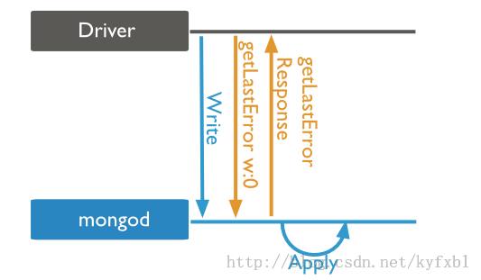
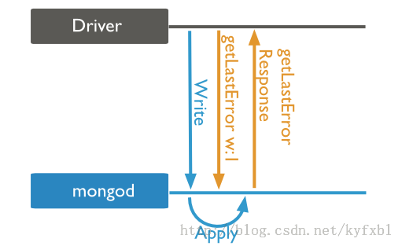
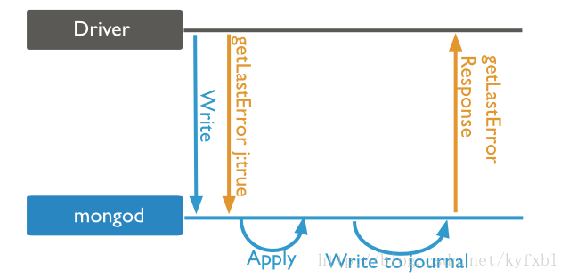
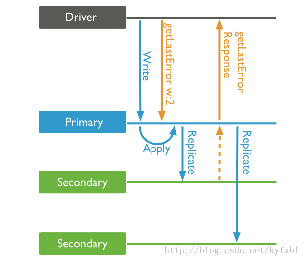

# MongoDB写关注 #

MongoDB提供了写关注，用来描述数据库写操作返回信息的保证级别。写关注的强度决定了保证的级别。当插入，更新，删除是弱写关注的时候，操作返回的速度则快。如果写关注是弱的，在一些写失败的时候，写操作可能不会持久。写关注级别越强，客户端则需要越长的时间来等待MongoDB确认写操作。

MongoDB提供了不同的写关注的级别来更好的满足不同应用程序的需求。在一个实际的MongoDB部署中，客户端需要调整写关注的级别来确保重要写操作的持久性。对于其他一些不那么重要的写操作，客户端需要调整到弱写关注来保证更好的性能。

# 写关注级别 #

MongoDB定义了如下四种写关注级别，依次从弱到强：

- Unacknowledged
- Acknowledged
- Journaled
- Replica Acknowledged

实际应用中一般是在Client Driver里设置写关注的，它和db.getLastError()方法关系很大。一般来说，Mongo Driver在执行一个写操作（insert，update，delete）之后，都会立刻调用db.getLastError()命令。这样才有机会知道刚才的写操作是否成功，如果捕获到错误，就可以进行相应的处理。MongoDB Server并不关心错误，只负责通知Client发生了错误。

这里有2点需要注意：
1. db.getLastError()方法是由Driver负责调用的，所以业务代码不需要去显式调用。
2. Driver调用db.getLastError()函数，但是并不一定能捕获到错误，这主要取决于Write Concern的设置级别。

## Unacknowledged ##



在这种写关注级别时，MongoDB立刻返回结果，然后执行写入操作，类似于忽略写错误。然而，驱动程序会去接收和处理网络错误。所以getLastError()的返回值一定是null，即使之后的Apply发生了错误，Driver也不知道。使用这个级别的Write Concern，Driver的写入调用立刻返回，所以性能是最好的，但是可靠性是最差的，因此并不推荐使用。在各平台最新版本的Driver中，也不再以0作为默认级别。其实还有一个w:-1的级别，是error ignored，基本上和w:0差不多。区别在于，w:-1不会捕获任何错误，而w:0可以捕获network error。


## Acknowledged ##



在这种写关注级别时，mongod确认写操作，并且在内存视图上完成数据改变。它允许客户端捕获网络，重复键等其它错误。和Unacknowledged的区别是，现在MongoDB只有在Apply（实际写入操作）完成之后，才会返回getLastError()的响应。所以如果写入时发生错误，Driver就能捕获到，并进行处理。这个级别的Write Concern具备基本可靠性。但是Acknowledged级别的写关注并不确保数据已经持久化到系统硬盘，它是MongoDB默认的写关注级别。


## Journaled ##



Acknowledged级别的Write Concern也不是绝对可靠的。因为MongoDB的Apply操作是将数据写入内存，定期通过fsync写入硬盘。如果在Apply之后，fsync之前mongod挂了，或者甚至Server挂了，那持久化实际上是失败的。但是在w:1的级别下，Driver无法捕获到这种情况下的error，因为response在Apply之后就已经返回到Driver。MongoDB解决这个问题的办法是使用Journal机制，写操作在写入内存之后，还会写到journal文件中，这样如果mongod非正常down掉，重启以后就可以根据journal文件中的内容，来还原写操作。

在Driver层面，则是除了设置w:1之外，再设置journal:true或j:true，来捕获这个情况下的error。在这种关注级别下，MongoDB能确保写操作将数据提交到了` journal`日志。这种写关注能保证MongoDB崩溃后恢复数据。当然，前提是你必须开启`journal`日志功能。但这样写操作必须等到下一次日志提交才返回结果，为了减少操作延迟，要提高日志提交的频率配置。

## Replica Acknowledged ##



这个写关注级别下，只有Secondary从Primary完成了复制之后，getLastError()的结果才会返回。也可以同时设置journal:true或j:true，则还要等journal写入也成功后才会返回。但是注意，只要Primary的journal写入就会返回，而不需要等待Secondary的journal也写入。类似的也可以设置w:3，表示至少要有3个节点有数据；或者w:majority，表示>1/2的节点有数据。一般小规模的集群就是3节点部署，所以配置w:2就可以了。


# 小结 #

设置Write Concern级别，其实就是在写操作的性能和可靠性之间做权衡。写操作的等待时间越长，可靠性就越好。对于非关键数据，建议使用默认的w:1就可以了，对于关键数据，则使用w:1 & j:true比较好。这里要注意，journal无论如何都是建议打开的，设置j:true，只是说Driver调用getLastError()之后是否要等待journal写入完成再返回。并不是说不设置j:true就关闭了server端的journal。

# 关于getLastError() #

一般来说，开发者写的代码，不需要自行调用db.getLastError()函数，Driver在每一个写操作之后，都会立刻自动调用该方法。

```
db.collection("test", {}, function(err, collection) {
    collection.insert({
        name: "world peace"
    },
    function(err, result) {
        assert.equal(null, err);
        console.log(result);
        db.close();
    })

});
```

这段代码，driver在insert()之后，隐式调用db.getLastError()，如果捕获到任何错误，就会赋给回调函数中的err参数。区别就在于是否能够捕获到错误。在w:-1时，err永远是null（没有机会捕获到error）；在w:0时，一般也捕获不到，除了network error；在w:1时，如果mongod apply发生错误，就会传递给err参数了。代码都是一样的，区别就在于设置的Write Concern级别。详细的说明请参考[http://docs.mongodb.org/manual/reference/command/getLastError/](http://docs.mongodb.org/manual/reference/command/getLastError/ "getLastError")。


