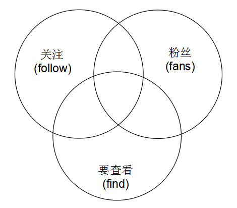

<!--
author: jockchou
date: 2015-07-23
title: 用redis实现微博关注关系
tags: redis，微博，关注
category: NoSQL开发
status: publish
summary:由于产品需求的需要，我们做的产品里要实现类似微博里的关注关系。在过去的一篇博客《用MySQL实现微博关注关系的方案分析》分析了MySQL实现方式以及优缺点，这篇博客介绍Redis的实现思路。
-->

由于产品需求的需要，我们做的产品里要实现类似微博里的关注关系。在过去的一篇博客《用MySQL实现微博关注关系的方案分析》分析了MySQL实现方式以及优缺点，这篇博客介绍Redis的实现思路。

## 关注关系产生的四种关系状态 ##

- 关注
- 粉丝
- 双向关注(互粉)
- 无关系 


## 需求分析 ##

在微博中，每一个用户都会有一个关注列表，一个粉丝列表。用户可以查看自己的关注，粉丝列表，也可以查看别人的关注，粉丝列表。并且，要展示列表里每个人与当前查看者的关注状态。状态的可能性就是上面讲到得四种关系状态。

问题可以分两种情况来看：

1. 看自己的关注，粉丝列表
2. 看别人的关注，粉丝列表

### 看自己的关注，粉丝列表： ###

这种情况相对简单一点。比如看自己的关注列表，列表里的人的与自己的关系状态不可能是“无关系”和“粉丝”。只可能是“关注”和“双向关注”。同样，粉丝列表也只有两种状态。


### 看别人的关注，粉丝列表： ###

这是最复杂的情况，假如看别人关注列表，列表里的人和自己可能有上述全部四种关系状态。

## 从集合的图来分析 ##



如上图所示。左边的圆表示用户的关注列表，右边的圆表示粉丝列表，下边的圆表示的是要查看的列表（集合）。分别用follow, fans, find来表明这三个集合。

当查看自己的列表时，其实表示find集合是上面集合中某一个的子集。例如查看自己粉丝，表示find是fans的子集，查看自己的关注，表示find是follow的子集。

查看别人的列表时，此时图中产生了三个集合的交集。要查询集合中的用户可能是在你的粉丝，关注集合中，也可能不在。就是说可能是任何一种关系状态，问题的根本就是，我们要计算出每一个用户与当前用户的关系状态。要求解四种关系状态，我们必然要求出图中下部分的三个小交集。

- 要查询的集合与我的互粉交集
- 要查询的集合与我的关注交集
- 要查询的集的与我的粉丝交集


不在这三个小交集中的用户就是无关系状态的用户。


假如我们采用如下一套命名:

>关注集合  
>follow:userID

>粉丝集合  
>fans:userID

>互粉集合(临时)  
>fofa:userID

>要查询的集合(临时)  
>find:userID

>要查询的集合与我的关注交集(临时)  
>find_inter_follow:userID  

>要查询的集的与我的粉丝交集(临时)  
>find_inter_fans:userID

>要查询的集合与我的互粉交集(临时)  
>find_inter_fofa:userID

>find中其他就是未关注


## 使用Sorted Set存储关系 ##

score用来存储关注的时间，每个用户存储两个集合。follow:userID存储用户的关注，fans:userID存储用户的粉丝。于是我们可以设计一个函数来求出这些状态的集合。

函数返回：

```
"findSet" => $findSet, //要查询的集合
"fofaSet" => $fofaSet, //互粉的集合
"findInterFollowSet" => $findInterFollowSet, //要查询的集合与我的关注交
"findInterFansSet" => $findInterFansSet //要查询的集的与我的粉丝交
```

求出以上四个集合，就可以进行关系状态判断，先判断是否互粉，如果不是互粉，再判断是否是我关注的，如果不是，再判断是否是我的粉丝。如果都不是就是无关系。这样就能把状态求出来了。


```
/*
* userID:当前用户id
* targetUserID: 被查看的人的id
* findType: 查看的是哪个列表
* findStart: 分页查看的列表开始的位置
* findEnd: 分页查看的列表结束的位置
*/
function getChunkSets($redis, $userID, $targetUserID, $findType, $findStart, $findEnd) {

		$fansKey = "fans:" . $userID;
		$followKey = "follow:" . $userID;
		$findKey = "find:" . $userID;

		$targetKey =  $findType. ":" . $targetUserID;
		$fofaKey = "find_inter_fofa:" . $userID;

		$findInterFollowKey = "find_inter_follow:" . $userID;
		$findInterFansKey = "find_inter_fans:" . $userID;

		//找出要查询的集合元素
		$findSet = $redis->zRevRange($targetKey, $findStart, $findEnd, TRUE);

		//要查询的集合与我的关注交
		$findInterFollowSet = array();

		//要查询的集的与我的粉丝交
		$findInterFansSet = array();

		//先清掉临时集合
		$redis->del($findKey);

		$redis->del($fofaKey);
		$redis->del($findInterFollowKey);
		$redis->del($findInterFansKey);


		//存起来
		foreach ($findSet as $uid => $score) {
			$redis->zAdd($findKey, $score, $uid);
		}

		//求互粉集合
		if ($userID != $targetUserID) { //看别人
			$redis->zInter($fofaKey, array($findKey, $fansKey, $followKey));

			/*
			 * 如果不是看自己的列表，还要求
			 * 1： 要查询的集合与我的关注交
			 * 2： 要查询的集的与我的粉丝交
			 */
			$redis->zInter($findInterFollowKey, array($findKey, $followKey));
			$redis->zInter($findInterFansKey, array($findKey, $fansKey));

			$findInterFollowSet = $redis->zRevRange($findInterFollowKey, 0, -1);
			$findInterFansSet = $redis->zRevRange($findInterFansKey, 0, -1);

		} else {
			if ($findType == "fans") { //自己看粉丝列表
				$redis->zInter($fofaKey, array($findKey, $followKey));
			} else if ($findType == "follow") { //看自己关注列表
				$redis->zInter($fofaKey, array($findKey, $fansKey));
			}
		}

		//互粉集合
		$fofaSet = $redis->zRevRange($fofaKey, 0, -1);

		return array(
			"findSet" => $findSet, //要查询的集合
			"fofaSet" => $fofaSet, //互粉的集合
			"findInterFollowSet" => $findInterFollowSet, //要查询的集合与我的关注交
			"findInterFansSet" => $findInterFansSet //要查询的集的与我的粉丝交
		);
	}
```


以上函数已经求出了所需要的集合，然后就是关系状态判断了。

```
/*
* isSelf: 是否查看自己的列表
* findType: 查看的是粉丝还是关注列表 1： 关注， 2: 粉丝
* userInfoArr: 用户详细信息数组
*/
function getUserInfoList($isSelf, $findType, $userInfoArr, $findSet, $fofaSet, $interFansSet, $interFollowSet) {

		$userInfoList = array();

		foreach($findSet as $userID => $favoTime) {
			if(!in_array($userID, array_keys($userInfoArr))) continue;

			$userInfo = new UserInfo($userInfoArr[$userID]);
			$userInfo = $userInfo->format();

			if(in_array($userID, $fofaSet)){
				$userInfo['favoFlag'] = 3; //互相关注
			} else {
				if($isSelf) {
					$userInfo['favoFlag'] = $findType;
				} else {
					if(in_array($userID, $interFansSet)) {
						$userInfo['favoFlag'] = 2; //我的粉丝
					} else if(in_array($userID, $interFollowSet)) {
						$userInfo['favoFlag'] = 1; //我的关注
					} else{
						$userInfo['favoFlag'] = 0; //无关系
					}
				}
					
			}

			$userInfo['favoTime'] = $favoTime;
			array_push($userInfoList, $userInfo);
		}

		return $userInfoList;
	}
```

