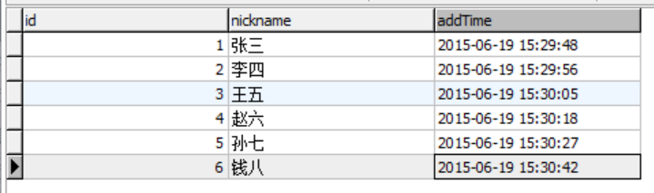
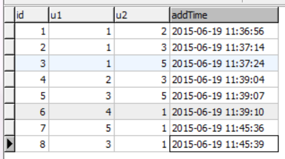
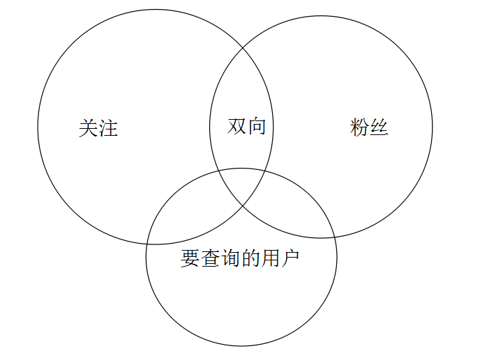

<!--
author: jockchou
date: 2015-07-23
title: 用MySQL实现微博关注关系的方案分析
tags: MySQL, 微博,关注关系
category: MySQL数据库
status: publish
summary: 由于产品需求的需要，我们做的产品里要实现类似微博里的关注关系。本文是以MySQL为基础，分析用MySQL如何实现微博的关注关系，对理解关注关系有一定的意义。
-->

由于产品需求的需要，我们做的产品里要实现类似微博里的关注关系。本文是以MySQL为基础，分析用MySQL如何实现微博的关注关系，对理解关注关系有一定的意义。

## 关注关系产生的四种关系状态 ##

- 关注
- 粉丝
- 双向关注(互粉)
- 无关系

用词follower表示粉丝		-- 追随者  
用词following表示关注	    -- 追随  


## 设计的结构必须能满足以下功能： ## 

- 查询关注列表
- 查询粉丝列表
- 查询双向关注列表
- 判断两个用户的关系
- 查询带关系状态的任一列表

## 第一种方案 ##
用一行纪录表示关注和粉丝，字段u2的值表示粉丝，u1表示被关注者。

Table: user(用户表)


Table: follower(u2表示粉丝， u1表示被关注的人)


查询用户id = 1的关注列表

```
SELECT * FROM follower WHERE u2 = 1
```

查询用户id = 1的粉丝列表

```
SELECT * FROM follower WHERE u1 = 1
```

查询用户id = 1的双向关注列表

```
SELECT t1.* FROM (SELECT * FROM follower WHERE u2 = 1)  AS t1 INNER JOIN follower t2 ON t1.u1 = t2.u2 LIMIT 10
```

判断两个用户的关系(id = 1  --> id = 5)

```
SELECT * FROM follower WHERE (u2 = 1 or u1 = 1) AND (u2 = 5 or u1 = 5) LIMIT 3
```

id = 1的用户查询所有 id < 5的用户，并显示关系



如上图所示，要查询的用户的那个圈，被分成了四个部分（上面讲的四种状态）：

- 关注了我的用户
- 和我互粉的用户
- 我关注了的用户
- 我未关注的用户

以上复杂的集合关系，通过单一SQL根本无法实现。

要查询的用户与粉丝集合的交集:

```
SELECT * FROM 

(SELECT * FROM user WHERE id < 5) AS t1
INNER JOIN

(SELECT * FROM follower WHERE u1 = 1) AS t2

ON t1.id = t2.u2
```


要查询的用户与关注集合的交集:

```
SELECT * FROM 

(SELECT * FROM user WHERE id < 5) AS t1
INNER JOIN

(SELECT * FROM follower WHERE u2 = 1) AS t3

ON t1.id = t3.u1
```

其他的部分可以通过以上两步查询出来的数据，在内存中作计算得出。

因为关注关系是互相的，用一行纪录即可表示。以上的设计其实是把关注和粉丝的概念用一行纪录表达。这样会引来一个缺点，当follower非常大的时候，对follower表进行分片，如果按u1或者u2分片，假设按u1分片，那么将导致关注列表，即下面的查询要做聚合。

```
SELECT * FROM follower WHERE u2 = 1
```

选择u1分片后，u2 = 1的数据行将会落到不同的分片上。

```
SELECT * FROM follower_0 WHERE u2 = 1
UNION 
SELECT * FROM follower_1 WHERE u2 = 1
```

而粉丝列表的查询不会受影响，同一个用户的所有粉丝分在一个片上。

```
SELECT * FROM follower_1 WHERE u1 = 1
```

如果按u2分片，同样也会导致粉丝列表会落在不同的分片上。两个查询不可能同时满足分片。

如果分片是跨数据库或者是跨主机的方案，问题会变得更复杂。

# 针对方片的优化方案 #

可以用冗余数据的办法来解决数据分片带来的问题，即将关注和粉丝分2个表存放。
用follower表存放粉丝  
用following表存放关注  

当用户Ub关注Ua，分别往follower, following写入一行纪录。 （Ua -> Ub） 只是他们表示的含义不同。

follower表示Ua的粉丝是Ub  
following表示Ub关注Ua  

分片的时候，同时对follower和following进行分片。同时上面分析的所有查询方法也要相应改变，思路还是一样，只是单个表的自联接变成2个表的联接。

以上方案缺点就是数据量会增加一倍，进行关注或者取消关注的写操作会多一次，要同时维护2个表的数据。

以上优化虽然解决了一些问题，但同时也带来一些问题。可见关系型数据库在处理用户关系的时候，表现得很吃力。我们不得不承认，虽然叫“关系”型数据库却不太懂得处理集合关系。


## 另一种方案 ##


还有一种方案，即用一行纪录表示出两个用户之间的所有关系，此方案能节省很大的数据空占用。

字段: u1, u2, type

type=1 表示u2关注u1  
type=2 表示u1,u2互相关注  
type=0 表示u1,u2无关系(默认)  

保证插入数据时，u1是被关注者，u2是粉丝（当然你也可以换过来，只是逻辑会变了）

每次写入数据时要检查当前的状态：

如果u1(1) -> u2(2)纪录已经存在（u2已经关注u1），这个时候u1再关注u2，只需要将type字段的值变为type = 2。

如果u1(1) -> u2(2) type(2)时，即u1和u2互相关注，如果有一个人取消关注，问题会很复杂，最坏的情况要修改整行纪录，交换u1,u2这两个字段的值，再修改type=1。

同时上面的方案查询也会变化。例如要查询id = 1的粉丝列表：

```
SELECT * FROM table WHERE u1 = 1 OR (u2 = 1 AND type = 2)
```
例如要查询id = 1的关注列表：

```
SELECT * FROM table WHERE u2 = 1 OR (u1 = 1 AND type = 2)
```

上面的方案只强调关注关系，双向关系只是在单一关系上用字段区分，关注的先后关系很明显，事务性更强。

查询id = 1的双向关注

```
SELECT * FROM table WHERE type = 2 AND (u1 = 1 OR u2 = 1)
```

这个方案虽然节省数据空间，但是不容易理解，而且写入时每次要检查判断当前的关系，逻辑上过于复杂。而且数据量大后，由于查询WHERE条件同时有u1和u2，很难进行分片。


# 其他一些问题 #

- ua与ub的共同关注列表
- ua与ub的共同粉丝列表
- ua的关注列表里谁关注了ub

以上的关系计算大家可能很容易理解，但要在MySQL里实现，是非常难的。

id = 3与id = 2的共同关注列表：

```
SELECT  u1, COUNT(id) AS num FROM follower WHERE u2 = 3 OR u2 = 2
GROUP BY u1 HAVING num > 1
```
id = 3与id = 1的共同粉丝列表：

```
SELECT  u2, COUNT(id) AS num FROM follower WHERE u1 = 3 OR u1 = 1
GROUP BY u2 HAVING num > 1

```

当然你可以用集合的方法查询:

```
SELECT t1.u2 FROM 
(SELECT  u2 FROM follower WHERE u1 = 3) AS t1
 INNER JOIN
(SELECT  u2 FROM follower WHERE u1 = 1) AS t2

ON t1.u2 = t2.u2
```

id = 1的关注列表里谁关注了id = 5
```
SELECT u2 FROM (SELECT u2 FROM follower WHERE u1 = 2) AS t1
INNER JOIN 
(SELECT u1 FROM follower WHERE u2 = 1) AS t2
ON t2.u1 = t1.u2
```